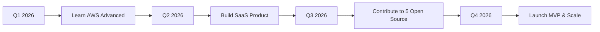

#  Hello, I'm Achmatfadilah (Prabu)

<h1 align="center">
  
</h1>

---

  
  
  
  
  
  
  
  

---

  
  
  
  
  

---

## 💫 Animation Banner

  

---

## 🐍 Snake Animation

  

---

## 🎮 Gaming & Fun Zone

  

### 🎮 Game Characters I Play

  
  
  
  
  
  
  
  
  
  

---

## 🖥️ About Me

Hello! I'm **Achmatfadilah** (also known as **Prabu**), a passionate **Fullstack Web Developer** based in Indonesia 🇮🇩

I specialize in building modern, scalable, and user-friendly web applications. With expertise in both frontend and backend technologies, I transform ideas into powerful digital solutions.

### 🎯 What I Do
- 🌐 Build responsive websites and web applications
- 🔧 Develop robust RESTful APIs and microservices
- 📱 Create intuitive user interfaces
- ☁️ Deploy and manage cloud infrastructure
- 🐛 Fix bugs and optimize performance

### 📚 Currently Learning
- ☸️ Kubernetes & Cloud Native
- 🔐 Cybersecurity Fundamentals
- 📊 System Architecture
- 🤖 AI/ML Integration

### ⚡ Fun Facts
- ☕ I run on coffee (at least 3 cups/day)
- 🌙 Most productive during midnight hours
- 🎮 Love gaming in free time (Valorant, Mobile Legends, Genshin Impact)
- 📖 Always reading tech blogs
- 💡 Open source enthusiast

### 🎯 2026 Goals
- Launch my own SaaS product
- Contribute to 10+ open source projects
- Achieve AWS Solutions Architect certification
- Build a developer community in Indonesia

---

## 🎮 My Gaming Setup

  
  
  
  
  

**Favorite Games:**
- 🎯 Valorant
- 🦸 Mobile Legends
- 🌸 Genshin Impact
- ⚔️ League of Legends
- 🚀 Apex Legends
- 🏎️ PUBG Mobile
- 🗡️ Honkai: Star Rail

---

## 🎵 Spotify Playing

  

---

## ⏱️ Time Since I Started Coding

  

---

## 🛠️ Technical Skills

### 💻 Programming Languages

  

### 🎨 Frontend Development

  

### 🎭 CSS & Styling

  

### ⚙️ Backend & Server

  

### 🗄️ Database & Storage

  

### ☁️ DevOps & Cloud

  

### 🛠️ Tools & Development

  

---

## 📊 GitHub Statistics

<table>
  <tr>
    <td valign="top" width="50%">
      
    </td>
    <td valign="top" width="50%">
      
    </td>
  </tr>
</table>

  

---

## 📈 GitHub Activity Graph

---

## 💼 Work Experience

### 🟢 Senior Fullstack Developer
**Tech Company** | *2023 - Present*

- Led development of enterprise-scale web applications
- Designed and implemented microservices architecture
- Mentored team of 5 junior developers
- Reduced deployment time by 60% with CI/CD pipelines
- Collaborated with stakeholders to define project requirements
- Tech Stack: React, Next.js, Node.js, PostgreSQL, AWS, Docker, Kubernetes

### 🟡 Fullstack Web Developer  
**Digital Agency** | *2021 - 2023*

- Developed 15+ client projects from scratch to deployment
- Built RESTful APIs serving 100k+ daily requests
- Created responsive and accessible user interfaces
- Implemented payment gateway integrations
- Tech Stack: Vue.js, Express, MongoDB, Redis, Vercel, Stripe

### 🔵 Junior Web Developer
**Startup Company** | *2019 - 2021*

- Created responsive web applications using React
- Assisted in backend API development with Node.js
- Participated in agile sprints and daily standups
- Fixed bugs and improved application performance
- Tech Stack: React, JavaScript, CSS, Node.js, MySQL, Firebase

---

## 🚀 Featured Projects

### 🔷 E-Commerce Platform
> A full-featured e-commerce platform with cart, payments, admin dashboard, and inventory management

**Key Features:**
- 🛒 Shopping cart & wishlist
- 💳 Payment gateway integration (Stripe, PayPal)
- 📊 Admin dashboard with analytics
- 📱 Mobile-responsive design
- 🔍 Advanced product search

**Tech Stack:** React, Node.js, PostgreSQL, Stripe, Docker, AWS S3

  
  
  
  

---

### 🔶 Task Management Application
> A collaborative task management tool with real-time updates, team collaboration, and Kanban boards

**Key Features:**
- 📋 Kanban board with drag & drop
- 👥 Team collaboration
- 💬 Real-time chat
- 📅 Calendar integration
- 🔔 Notifications

**Tech Stack:** Next.js, TypeScript, MongoDB, Socket.io, Tailwind CSS, Pusher

  
  
  
  

---

### 🔸 Weather Dashboard
> A beautiful weather dashboard with forecasts, interactive maps, and location-based alerts

**Key Features:**
- 🌤️ Current weather & 7-day forecast
- 🗺️ Interactive weather maps
- 📍 Location-based updates
- ⚠️ Weather alerts
- 🌙 Dark/Light mode

**Tech Stack:** Vue.js, Python, FastAPI, OpenWeatherMap API, Chart.js

  
  
  
  

---

### 🔹 Social Media App
> A social media platform with posts, likes, comments, and user profiles

**Key Features:**
- 📝 Create & share posts
- ❤️ Like & comment system
- 👤 User profiles & followers
- 🔔 Real-time notifications
- 🔍 Search users & posts

**Tech Stack:** MERN Stack (MongoDB, Express, React, Node), Socket.io, AWS S3

  
  
  
  

---

## 🎯 My Roadmap 2026

### Quarterly Goals

| Quarter | Goal | Status |
|---------|------|--------|
| Q1 2026 | AWS Solutions Architect Certification | 📚 Learning |
| Q2 2026 | Launch SaaS Product MVP | 🚧 Building |
| Q3 2026 | Contribute to 5 Open Source Projects | 🔄 Planning |
| Q4 2026 | Scale to 1000 Users | 🎯 Target |

---

## 🏆 Achievements

  

---

## 📊 Most Used Languages

  

---

## 📝 Recent Blog Posts

- 📄 [Building Scalable Web Applications with React & Node.js](https://medium.com/@achmatfadilah)
- 📄 [Mastering TypeScript in 2026: Complete Guide](https://medium.com/@achmatfadilah)
- 📄 [REST vs GraphQL: Which to Choose for Your Project?](https://medium.com/@achmatfadilah)
- 📄 [Docker Best Practices for Production Applications](https://medium.com/@achmatfadilah)
- 📄 [How I Built My First SaaS Product from Scratch](https://medium.com/@achmatfadilah)

---

## ⏱️ Coding Statistics

  

---

## 🌟 Top Repositories

  
  
  

---

## 📬 Contact Information

### 📧 Email
- **Primary:** prabudillah30@gmail.com
- **Secondary:** achmatfadilah@gmail.com

### 📱 Social Media

  
  
  
  
  
  
  

---

## 💖 Support Me

  
  
  

---

## 🎊 Party Time! 🎊

  
  
  
  
  
  
  
  
  
  

---

## 💻 OS/Browser I Use

  
  

---

## 📱 Device I Use

  
  
  

---

## 📊 Dynamic Stats

  

---

##  Thank You!

  

    
  

  
  

    
  

  
  

    ⭐ Thanks for visiting my profile! Let's build something amazing together.
  

  
  

    <strong>Made with ❤️ by Achmatfadilah (Prabu)</strong>
  

