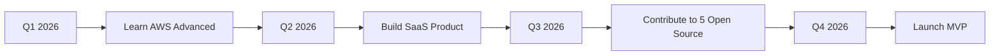

#  Hello, I'm Achmatfadilah

<h1 align="center">
  
</h1>

---

  
  
  
  
  
  
  

---

  
  
  
  

---

## 💫 Animation Banners

  

---

## 🖥️ About Me

- 🔭 **Current Work:** Building enterprise web applications
- 🌱 **Learning:** Cloud Architecture, System Design, DevOps
- 👯 **Looking to collaborate** on open source projects
- 🤝 **Looking for help with** GraphQL, WebSocket, Real-time apps
- 💬 **Ask me about:** React, Node.js, TypeScript, PostgreSQL, MongoDB
- 📫 **Email:** achmatfadilah@gmail.com
- ⚡ **Fun fact:** I debug code faster after midnight 🌙
- 🎯 **2026 Goal:** Launch my own SaaS product
- 🎮 **Hobbies:** Gaming, Reading, Coffee ☕

---

## 🛠️ Technical Skills

### Programming Languages

  

### Frontend Framework & Library

  

### CSS & Styling

  

### Backend & API

  

### Database

  

### DevOps & Cloud

  

### Tools & Development

  

---

## 📊 GitHub Statistics

<table>
  <tr>
    <td valign="top" width="50%">
      
    </td>
    <td valign="top" width="50%">
      
    </td>
  </tr>
</table>

  

---

## 📈 GitHub Activity Graph

---

## 💼 Work Experience

### 🟢 Senior Fullstack Developer
**Company Name** | *2023 - Present*

- Led development of enterprise-scale web applications
- Implemented microservices architecture using Docker & Kubernetes
- Mentored team of 5 junior developers
- Reduced deployment time by 60% with CI/CD pipelines
- Tech Stack: React, Node.js, PostgreSQL, AWS, Docker

### 🟡 Fullstack Web Developer  
**Company Name** | *2021 - 2023*

- Developed 15+ client projects from scratch to deployment
- Built RESTful APIs serving 100k+ daily requests
- Collaborated with UX/UI designers for optimal user experience
- Tech Stack: Next.js, Express, MongoDB, Redis, Vercel

### 🔵 Junior Web Developer
**Company Name** | *2019 - 2021*

- Created responsive web applications using React
- Assisted in backend development with Node.js
- Participated in agile sprints and daily standups
- Tech Stack: React, JavaScript, CSS, Node.js, MySQL

---

## 🚀 Featured Projects

### 🔷 E-Commerce Platform
> A full-featured e-commerce platform with cart, payments, and admin dashboard

**Tech Stack:** React, Node.js, PostgreSQL, Stripe, Docker, AWS

  
  
  
  

---

### 🔶 Task Management App
> A collaborative task management tool with real-time updates

**Tech Stack:** Next.js, TypeScript, MongoDB, Socket.io, Tailwind CSS

  
  
  
  

---

### 🔸 Weather Dashboard
> A beautiful weather dashboard with forecasts and maps

**Tech Stack:** Vue.js, Python, FastAPI, OpenWeatherMap API

  
  
  
  

---

## 🎯 My Roadmap 2026

---

## 🏆 Achievements

  

---

## 📊 Most Used Languages

  

---

## 📝 Recent Blog Posts

- 📄 [Building Scalable Web Applications with React](https://medium.com/@achmatfadilah)
- 📄 [Mastering TypeScript in 2026](https://medium.com/@achmatfadilah)
- 📄 [REST vs GraphQL: Which to Choose?](https://medium.com/@achmatfadilah)
- 📄 [Docker Best Practices for Developers](https://medium.com/@achmatfadilah)

---

## 🔥 Hot Stats

  

---

## 🤝 Friends & Collaborators

  

---

## 📬 Get In Touch

  
  
  
  
  
  
  

---

## 💖 Support Me

  
  
  

---

  

    
  

  
  

    
  

  
  

    ⭐ From Achmatfadilah with ❤️
  

